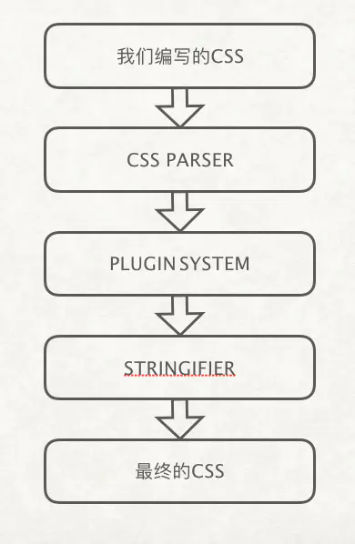

- 什么是postcss?
PostCSS 提供了一个解析器，它能够将 CSS 解析成抽象语法树（AST）。我们可以通过“插件”来传递AST，然后再把AST转换成一个串，最后再输出到目标文件中去。postcss提供了丰富的API可以用。

- 如何在项目中使用postcss和postcss相关插件？
    - 在webpack loader中配置postcss，postcss会将css文件转换成AST，所以我们需要为css文件配置postcss-loader，vue-cli3及以上版本都默认配置了postcss，所以你无需再配置。如果你的项目配置的less sass之类的，需要将less-loader或者sass-loader配置在postcss下面。因为postcss只接受css，无法编译less和sass以及其他语法。
    - 新增postcss.config.js文件
- postcss插件开发流程和规范
    - 用postcss-前缀清除名称。
    - 一个插件只做一件事情，也就是单一职责。
    - 通过 postcss.plugin 来创建你的插件
    - 只使用postcss提供的公共的api来编写，PostCSS插件不得依赖未记录的属性或方法，postcss提供可很多非常好用的[api](https://postcss.org/api/)。
- 实践
    - postcss-border-1px开发、npm包和github