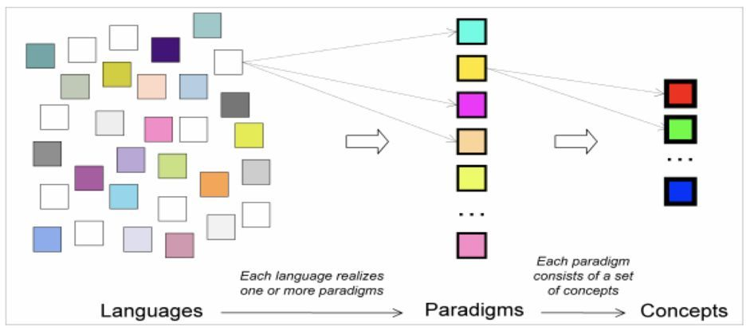
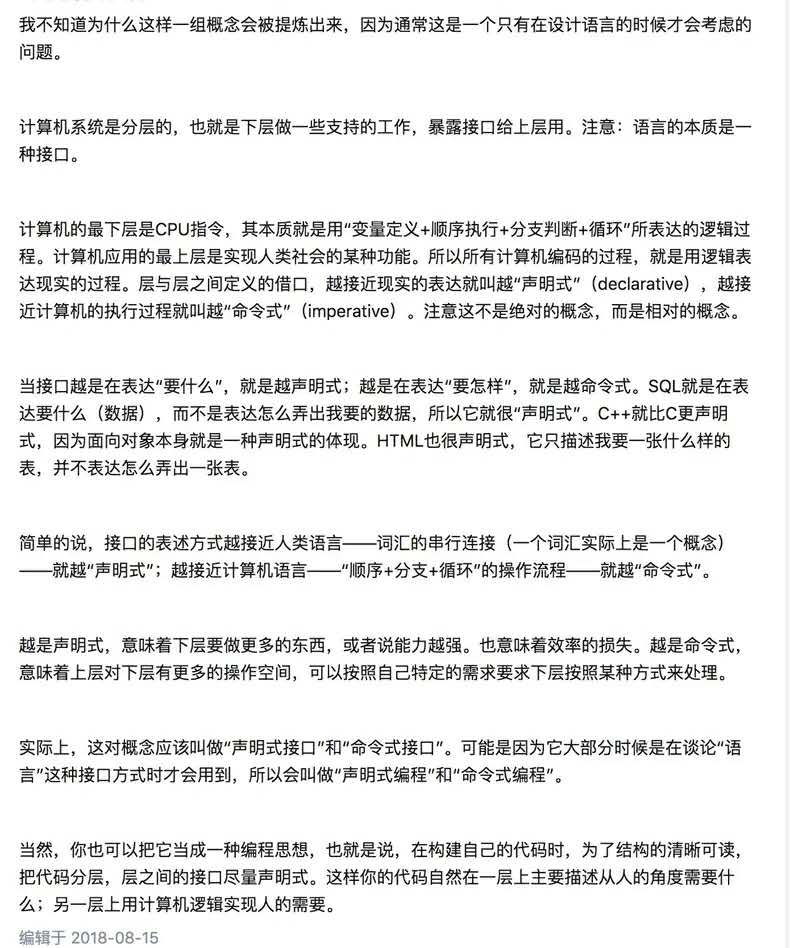
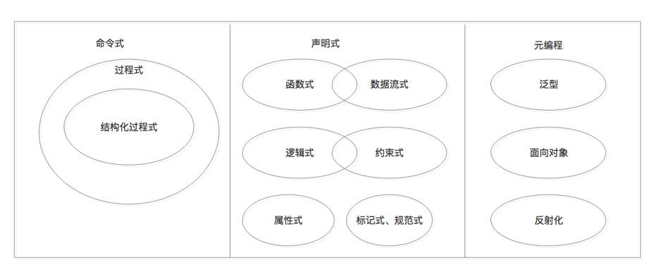
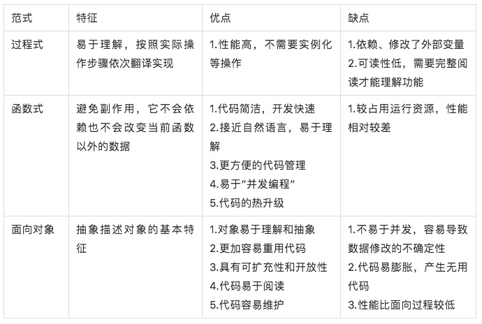
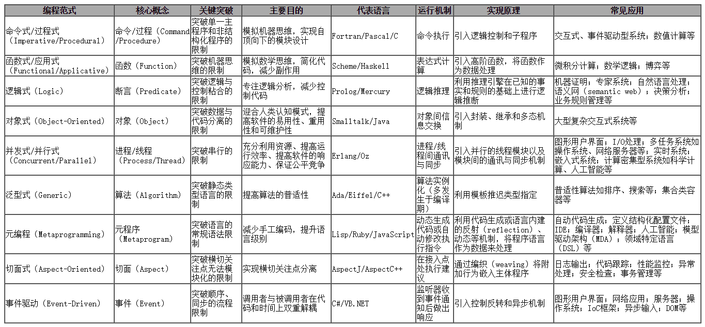

# 编程范式

## 基本概念
 范式译自英文的paradigm，也有译作典范、范型、范例的。所谓编程范式（programming paradigm），指的是计算机编程的基本风格或典范模式。借用哲学的术语，如果说每个编程者都在创造虚拟世界，那么编程范式就是他们置身其中自觉不自觉采用的世界观和方法论。

 我们知道，编程是为了解决问题，而解决问题可以有多种视角和思路，其中普适且行之有效的模式被归结为范式。比如我们常用的“面向对象编程”就是一种范式。由于着眼点和思维方式的不同，相应的范式自然各有侧重和倾向，因此一些范式常用‘oriented’来描述。换言之，每种范式都引导人们带着某种的倾向去分析问题、解决问题。

 编程范式是抽象的，必须通过具体的编程语言来体现。它代表的世界观往往体现在语言的核心概念中，代表的方法论往往体现在语言的表达机制中。一种范式可以在不同的语言中实现，一种语言也可以同时支持多种范式。比如，PHP可以面向过程编程，也可以面向对象编程。任何语言在设计时都会倾向某些范式，同时回避某些范式，由此形成了不同的语法特征和语言风格。

## 基本分类

### **命令(指令)式编程(Imperative Programming)**
> 命令式编程是面向计算机硬件的抽象，有变量（对应着存储单元），赋值语句（获取，存储指令），表达式（内存引用和算术运算）和控制语句（跳转指令），命令式程序就是一个冯诺依曼机的指令序列
- 面向对象编程

### **声明式编程(Declarative programming)**
- 子编程范式：
    - 约束式编程，在约束式编程中，变量之间的关系是在约束中说明的，定义了问题的解的范围。这些约束然后被应用程序来求解，以使得每个变量获得一个值，并让最多的约束得到满足。约束式编程经常被用作函数式编程、逻辑编程甚至命令式编程的补充。
    - 领域专属语言，一些著名的声明式领域专属语言（DSLs）包括yacc语法分析器，编译说明语言Make，Puppet管理配置语言，正则表达式和SQL的一些子集（例如Select queries等）。DSLs有时非常有用，并且不需要是图灵完全的，这往往让其很容易以一种纯声明式的方式来表达。很多文本标记语言例如HTML、MXML、XAML和XSLT往往是声明式的
    - 函数式编程，函数式编程，特别是纯函数式编程，尝试最小化状态带来的副作用，因此被认为是声明式的。大多数函数式编程语言，例如Scheme、Clojure、Haskell、OCaml、Standard ML和Unlambda，允许副作用的存在。
    - 逻辑式编程，如Prolog声明关系并且对关系进行提问。同函数式编程一样，许多逻辑编程语言允许副作用的存在。

## 面向对象式与函数式区别

| 面向对象式 | 函数式 |
| ------ | ------ | ------ |
| 用名词抽象世界，从而达到对于事物的封装和重用。 | 用动词(表达式)抽象世界，从而达到对于行为的封装和重用。 |

