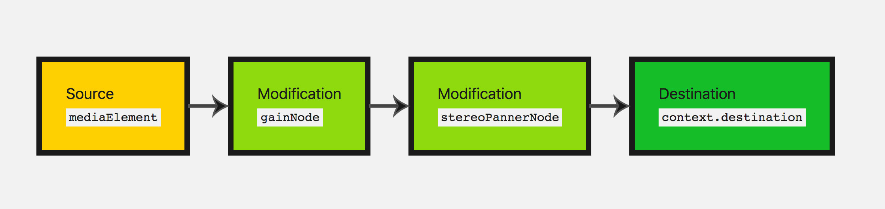

# 网页中使用音频的几种方式

- 使用 \<bgsound>标签  （Obsolete）已过时（Non-standard）非标准
- 使用\<embed>标签 (\<embed>元素将外部内容嵌入文档中的指定位置。此内容由外部应用程序或其他交互式内容源（如浏览器插件）提供。PS.可以借此引入html和svg等文件)
- 使用 \<audio>标签（HTMLAudio​Element）
    - 直接使用audio标签
    - new audio()
    - createElement
- 使用AudioContext API（AudioSourceNode--[connect]-->modificationNode--[connect]-->Destination）

    > 一个AudioNode 既有输入也有输出。输入与输出都有一定数量的通道。只有一个输出而没有输入的 AudioNode 叫做音频源。处理多个 AudioNode 时，一般来说, 一个模块读取它的输入，做一些处理。后输出新生成的结果。不同的模块可以连接在一起构建一个处理图。 这样一个处理图包含 AudioContext。 每个 AudioNode 只有一个这样的上下文。
    - 音频源：\<video> 或者\<audio>标签,我们需要从该元素中获取源并将其传入我们创建的上下文中。可以使用AudioContext.createMediaElementSource(myMediaElement)获得MediaElementAudioSourceNode。
    - 音频源：oscillator振荡器，表示一个周期的波形 audioCtx.createOscillator()
    - 音频源：stream（Audio​Context​[create​Buffer()，create​Buffer​Source(),decode​Audio​Data(),create​Media​Stream​Source()]）

# Q&A
- 在控制台下遇到这个警告：The AudioContext was not allowed to start. It must be resumed (or created) after a user gesture on the page.

    大概意思就说AudioContext需要用户手动触发，所以只需要将new AudioContext()移动到事件内部就行了。因为需要玩家主动点击后才能播放，所以，需要监督玩家点击了后，才播放背景音乐。AudioContext.resume(); 还原一下播放也可以。