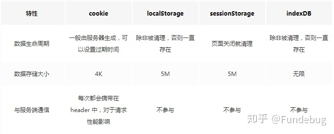

## 网页存储技术相关

- WebStorage(存储较少量的数据)
    - local storage: 本地存储,用于长期保存网站的数据，并且站内任何页面都可以访问该数据。
    - session storage: 会话存储,用于临时保存针对一个窗口（或标签页）的数据。在访客关闭窗口或者标签页之前，这些数据是存在的(刷新也存在)，而关闭之后就会被浏览器删除。
- IndexDB(存储更大量的结构化数据): 是一种低级API，用于客户端存储大量结构化数据(包括, 文件/ blobs)。该API使用索引来实现对该数据的高性能搜索。
- cookies
    - 生成方式一：http response header中的set-cookie
    - 生成方式二：js中可以通过document.cookie可以读写cookie，以键值对的形式展示
- PWA
    - cache storage
    - service worker
    - Web App manifest
- applicatoin cache（已废弃）：若想为应用启用应用缓存，你需要在应用页面中的 \<html> 元素上增加 manifest 特性，manifest 特性与 缓存清单(cache manifest) 文件关联，这个文件包含了浏览器需要为你的应用程序缓存的资源(文件)列表。
- webSQL （已废弃）：关系型数据库,使用SQL查询数据

-  Storage API: 该API允许网站的代码、Web 应用程序知道它们可以使用、已经使用多少存储空间。空间不足时，用户代理会自动清理站点数据，以便为其他用途腾出空间。而且 Storage API 甚至可以控制：在执行清理之前，是否需要提醒代码或 Web 应用程序，以便作出反应。

- FileSystem API （非标准，已废弃）

|API              |  数据模型	| 持久化   |  浏览器支持 |	 事务处理 |	同步/异步  |
| ------ | ------ | ------ | ------ | ------ | ------ |
|File system	 |  字节流	    | 设备	   |    52%	    |    不支持  |	异步     |
|Local Storage	 |  键/值	    | 设备	   |    93%	    |    不支持  |	同步     |
|Session Storage |  键/值       | 会话	   |    93%	    |    不支持  |	同步     |
|Cookie	         |  结构化      | 设备	   |    100%	|    不支持  |	同步     |
|WebSQL	         |  结构化      | 设备	   |    77%	    |    支持	 |  异步     |
|Cache	         |  键/值	    | 设备	   |    60%	    |    不支持  |	异步     |
|IndexedDB	     |  混合	    | 设备	   |    83%	    |    支持	 |  异步     |
|cloud storage	 |  字节流	    | 全局	   |    100%	|    不支持  |	两者皆有  |