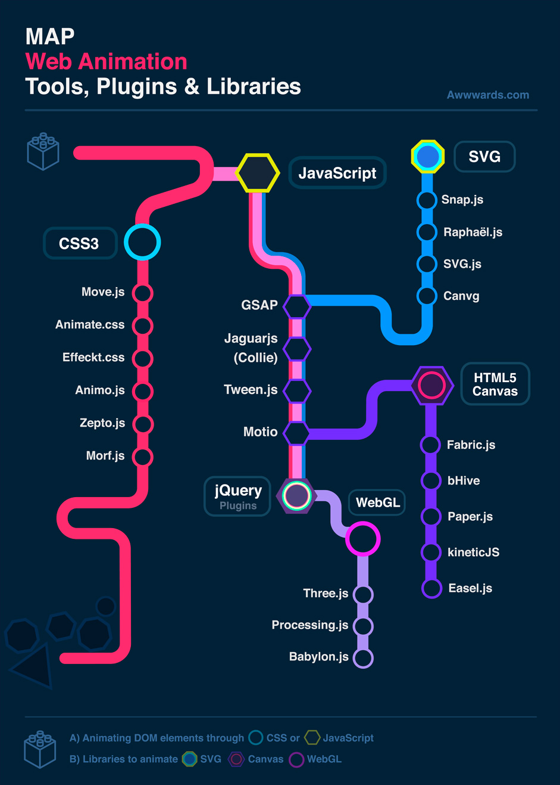
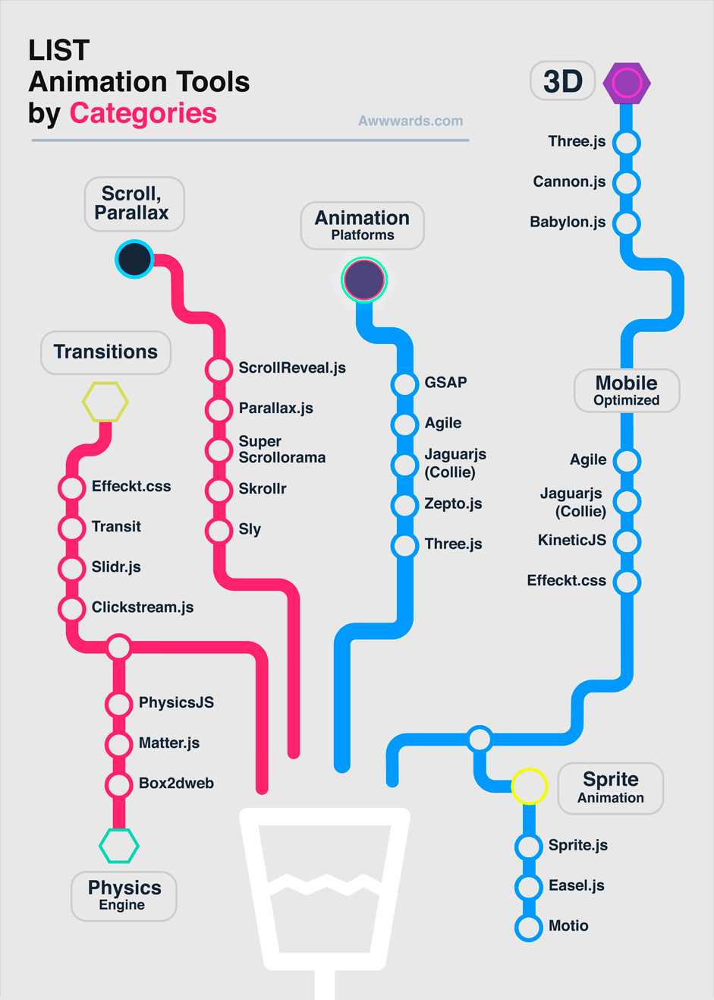
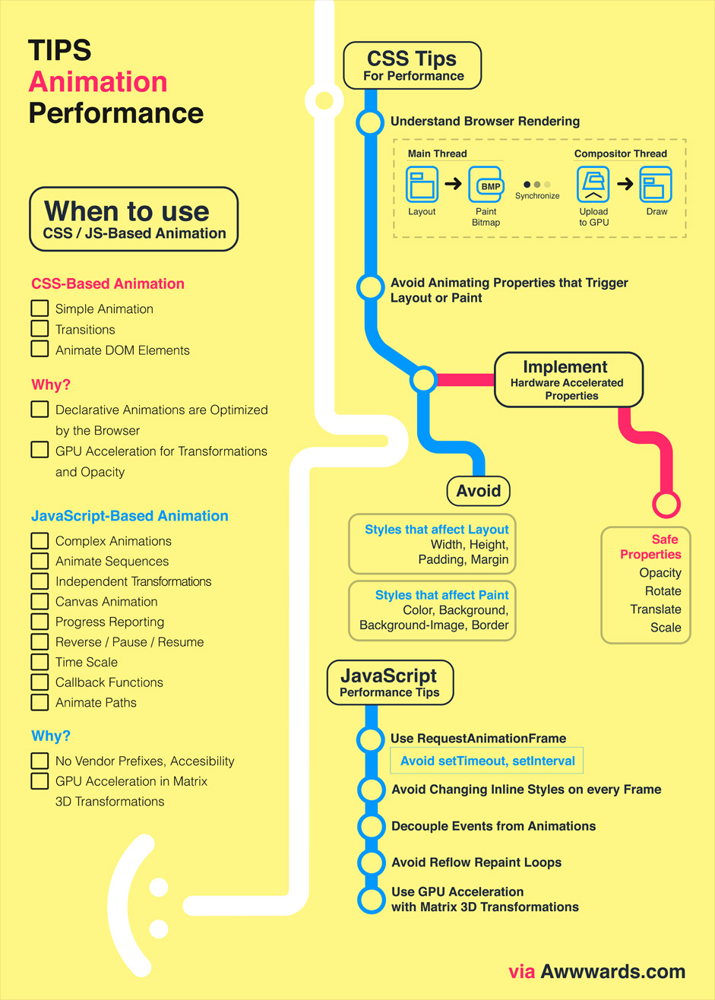

# Web 动画

## 实现形式

### 动图,视频
- GIF
- WebP
- APNG
- embed，object，video标签

### 浏览器插件
- Flash
- SilverLight
- Java Applet

### CSS
- animation
- transform
- transition

### SVG
> SVG的动画元素是和SMIL开发组合作开发的。SMIL开发组和SVG开发组合作开发了SMIL动画规范，在规范中制定了一个基本的XML动画特征集合。SVG吸收了SMIL动画规范当中的动画优点，并提供了一些SVG继承实现。
- \<anime>
- \<animateMotion>
- \<animateTransform>
- \<animateColor>

### JS定时器 + CSS/SVG 属性修改及控制 API
- setTimeout
- setInterval
- requestAnimationFrame
- SVGSVGElement API

### Canvas API

### web animation api(WAAPI)
> 为JavaScript开发人员提供了对浏览器动画引擎的访问，并描述了如何跨浏览器实现动画。
- 时间模型(时序模型),处理时间-时间选择(Timing,时机的掌握,事情发生或计划安排的特定时间),跟踪我们来到的设定时间线的距离。时间轴，时间线。
- 动画模型,处理随时间变化的视觉变化,确定动画对象在任何给定时间应该是什么样子。可以被视为动画在任何给定时间看起来像的快照数组，沿着动画的持续时间排列。

## 类库
- 动画引擎库anime.js，GSAP（GreenSock Animation Platform两个版本ActionScript 版本，已经在flash平台上运行多年，js版本可以说是AS版本的移植版）等（2D动画引擎）
- Three.js是一个基于JavaScript，运行在浏览器中的3D框架，可以用它创建各种三维场景，包括摄影机，光影及材质等各种对象，并且提供了Canvas 2D、SVG、CSS3D及WebGL中的渲染器（CanvasRenderer，SVGRenderer，CSS2DRenderer，CSS3DRenderer，WebGLRenderer，WebGLShaders）。

WebAnimation地图

WebAnimation工具

WebAnimation性能与技巧

